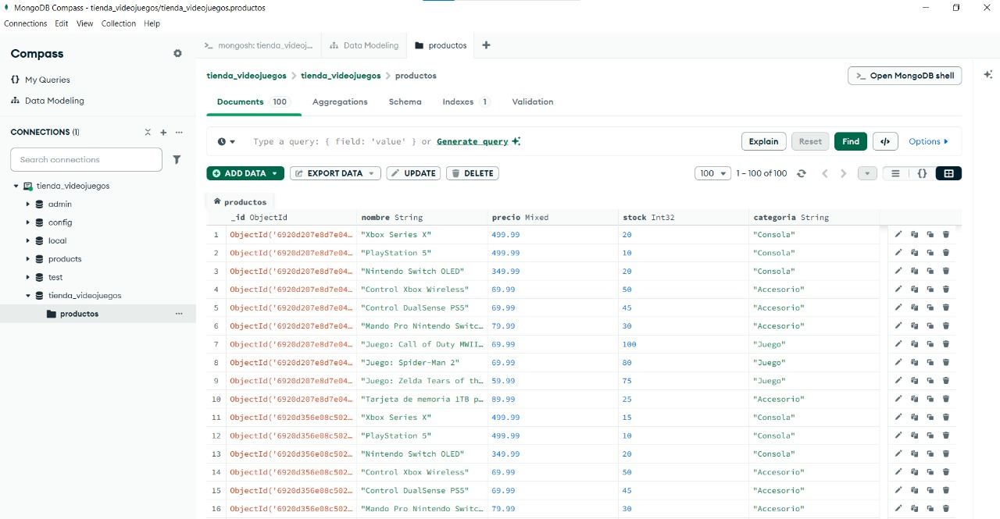

<p align="center">
  
</p>

# Tienda de Electrónica de Videojuegos — Documentación MongoDB

> Base de datos sencilla para una tienda online de productos de videojuegos.  
> Hecha para ejecutarse en **`mongosh`** (MongoDB Shell) y visualizarse en **MongoDB Compass**.


---

## Estructura de la Base de Datos

- **Base de datos**: `tienda_videojuegos`  
- **Colección principal**: `productos`

### Interfaz de MongoDB Compass
<p align="center">
  
</p>

## Esquema del documento (`productos`)

| Campo      | Tipo      | Descripción                                 |
|------------|-----------|----------------------------------------------|
| `_id`      | ObjectId  | ID único generado por MongoDB                |
| `nombre`   | string    | Nombre del producto (ej. `"Xbox Series X"`) |
| `precio`   | number    | Precio en USD (ej. `499.99`)                |
| `stock`    | number    | Cantidad disponible en inventario           |
| `categoria`| string    | Categoría: `"Consola"`, `"Juego"`, `"Accesorio"`, `"PC Gaming"`, `"Hardware"` |

---

## 1. Creación e Inserción de Datos

### Crear / Usar la base de datos
Este comando crea la base de datos `tienda_videojuegos` si no existe, y cambia el contexto de `mongosh` para trabajar sobre ella.
```js
use tienda_videojuegos
```

###  Inserción Masiva de Datos (`insertMany`)
Este comando inserta un arreglo de documentos (en este caso, 100 registros) en la colección `productos`. Es la forma más eficiente de añadir datos iniciales al sistema.
```js
db.productos.insertMany([

  { nombre: "Xbox Series X", precio: 499.99, stock: 15, categoria: "Consola" },
  { nombre: "PlayStation 5", precio: 499.99, stock: 10, categoria: "Consola" },
  { nombre: "Nintendo Switch OLED", precio: 349.99, stock: 20, categoria: "Consola" },
  { nombre: "Steam Deck OLED 512GB", precio: 649.99, stock: 8, categoria: "Consola" },
  { nombre: "PlayStation 5 Digital Edition", precio: 399.99, stock: 12, categoria: "Consola" },
  { nombre: "Xbox Series S", precio: 299.99, stock: 18, categoria: "Consola" },
  { nombre: "Nintendo Switch Lite", precio: 199.99, stock: 25, categoria: "Consola" },
  { nombre: "RetroN 77 (Atari 2600)", precio: 59.99, stock: 30, categoria: "Consola" },
  { nombre: "Analogue Pocket", precio: 219.99, stock: 7, categoria: "Consola" },
  { nombre: "Oculus Quest 3 128GB", precio: 499.99, stock: 9, categoria: "Consola" },

  { nombre: "Juego: Call of Duty: Black Ops 6", precio: 69.99, stock: 100, categoria: "Juego" },
  { nombre: "Juego: Grand Theft Auto VI (Reserva)", precio: 79.99, stock: 200, categoria: "Juego" },
  { nombre: "Juego: Spider-Man 2", precio: 69.99, stock: 80, categoria: "Juego" },
  { nombre: "Juego: Final Fantasy XVI", precio: 59.99, stock: 60, categoria: "Juego" },
  { nombre: "Juego: Zelda: Tears of the Kingdom", precio: 59.99, stock: 75, categoria: "Juego" },
  { nombre: "Juego: Super Mario Bros. Wonder", precio: 59.99, stock: 90, categoria: "Juego" },
  { nombre: "Juego: Starfield", precio: 69.99, stock: 70, categoria: "Juego" },
  { nombre: "Juego: Forza Motorsport (2023)", precio: 69.99, stock: 45, categoria: "Juego" },
  { nombre: "Juego: Baldur's Gate 3", precio: 59.99, stock: 110, categoria: "Juego" },
  { nombre: "Juego: Elden Ring: Shadow of the Erdtree", precio: 39.99, stock: 130, categoria: "Juego" },
  { nombre: "Juego: Alan Wake 2", precio: 49.99, stock: 55, categoria: "Juego" },
  { nombre: "Juego: Tekken 8", precio: 69.99, stock: 65, categoria: "Juego" },
  { nombre: "Juego: Diablo IV", precio: 69.99, stock: 85, categoria: "Juego" },
  { nombre: "Juego: Street Fighter 6", precio: 59.99, stock: 70, categoria: "Juego" },
  { nombre: "Juego: Pikmin 4", precio: 59.99, stock: 50, categoria: "Juego" },
  { nombre: "Juego: Metroid Prime Remastered", precio: 39.99, stock: 40, categoria: "Juego" },
  { nombre: "Juego: Hollow Knight: Silksong (Reserva)", precio: 29.99, stock: 300, categoria: "Juego" },
  { nombre: "Juego: Persona 5 Royal", precio: 49.99, stock: 60, categoria: "Juego" },
  { nombre: "Juego: Resident Evil 4 Remake", precio: 59.99, stock: 95, categoria: "Juego" },
  { nombre: "Juego: Marvel's Spider-Man: Miles Morales", precio: 49.99, stock: 75, categoria: "Juego" },
  { nombre: "Juego: Hogwarts Legacy", precio: 59.99, stock: 80, categoria: "Juego" },
  { nombre: "Juego: Cyberpunk 2077: Phantom Liberty", precio: 29.99, stock: 120, categoria: "Juego" },
  { nombre: "Juego: The Legend of Zelda: Link's Awakening", precio: 59.99, stock: 35, categoria: "Juego" },
  { nombre: "Juego: Animal Crossing: New Horizons", precio: 59.99, stock: 65, categoria: "Juego" },
  { nombre: "Juego: Super Smash Bros. Ultimate", precio: 59.99, stock: 50, categoria: "Juego" },
  { nombre: "Juego: Mario Kart 8 Deluxe", precio: 59.99, stock: 70, categoria: "Juego" },
  { nombre: "Juego: God of War Ragnarök", precio: 59.99, stock: 60, categoria: "Juego" },
  { nombre: "Juego: Ghost of Tsushima Director's Cut", precio: 49.99, stock: 55, categoria: "Juego" },
  { nombre: "Juego: Red Dead Redemption 2", precio: 39.99, stock: 90, categoria: "Juego" },
  { nombre: "Juego: The Last of Us Part I", precio: 59.99, stock: 45, categoria: "Juego" },
  { nombre: "Juego: Horizon Forbidden West", precio: 49.99, stock: 50, categoria: "Juego" },
  { nombre: "Juego: Minecraft (Edición Nintendo Switch)", precio: 29.99, stock: 150, categoria: "Juego" },
  { nombre: "Juego: Stardew Valley", precio: 14.99, stock: 200, categoria: "Juego" },
  { nombre: "Juego: Celeste", precio: 19.99, stock: 180, categoria: "Juego" },
  { nombre: "Juego: Hades", precio: 24.99, stock: 160, categoria: "Juego" },
  { nombre: "Juego: Among Us", precio: 4.99, stock: 300, categoria: "Juego" },
  { nombre: "Juego: Rocket League", precio: 19.99, stock: 250, categoria: "Juego" },
  { nombre: "Juego: Fall Guys", precio: 19.99, stock: 220, categoria: "Juego" },
  { nombre: "Juego: Fortnite Crew Pack", precio: 11.99, stock: 500, categoria: "Juego" },

  { nombre: "Control Xbox Wireless", precio: 69.99, stock: 50, categoria: "Accesorio" },
  { nombre: "Control DualSense PS5", precio: 69.99, stock: 45, categoria: "Accesorio" },
  { nombre: "Mando Pro Nintendo Switch", precio: 79.99, stock: 30, categoria: "Accesorio" },
  { nombre: "Tarjeta de memoria 1TB para PS5", precio: 89.99, stock: 25, categoria: "Accesorio" },
  { nombre: "Tarjeta microSD 512GB para Switch", precio: 79.99, stock: 40, categoria: "Accesorio" },
  { nombre: "Cargador Dock Xbox Series X|S", precio: 29.99, stock: 35, categoria: "Accesorio" },
  { nombre: "Cargador Dual PlayStation", precio: 24.99, stock: 45, categoria: "Accesorio" },
  { nombre: "Soporte Vertical PS5", precio: 29.99, stock: 20, categoria: "Accesorio" },
  { nombre: "Soporte Vertical Xbox Series X", precio: 24.99, stock: 22, categoria: "Accesorio" },
  { nombre: "Audífonos HyperX Cloud II", precio: 99.99, stock: 30, categoria: "Accesorio" },
  { nombre: "Audífonos SteelSeries Arctis Nova 7", precio: 179.99, stock: 15, categoria: "Accesorio" },
  { nombre: "Micrófono Blue Yeti Nano", precio: 99.99, stock: 20, categoria: "Accesorio" },
  { nombre: "Webcam Logitech C920 HD", precio: 69.99, stock: 25, categoria: "Accesorio" },
  { nombre: "Alfombrilla de ratón Corsair MM300", precio: 29.99, stock: 60, categoria: "Accesorio" },
  { nombre: "Estuche para Switch con espacio para juegos", precio: 19.99, stock: 50, categoria: "Accesorio" },
  { nombre: "Funda de silicona PS5", precio: 14.99, stock: 70, categoria: "Accesorio" },
  { nombre: "Cable HDMI 2.1 2m", precio: 12.99, stock: 100, categoria: "Accesorio" },
  { nombre: "Adaptador USB-C a HDMI", precio: 19.99, stock: 80, categoria: "Accesorio" },
  { nombre: "Batería externa para Switch (10,000 mAh)", precio: 49.99, stock: 25, categoria: "Accesorio" },
  { nombre: "Luces RGB para setup (Kit 4 tiras)", precio: 39.99, stock: 35, categoria: "Accesorio" },
  { nombre: "Soporte para teléfono + consola", precio: 24.99, stock: 40, categoria: "Accesorio" },
  { nombre: "Protectores de pantalla para Switch", precio: 9.99, stock: 120, categoria: "Accesorio" },
  { nombre: "Carcasa personalizada PS5 (edición limitada)", precio: 34.99, stock: 10, categoria: "Accesorio" },
  { nombre: "Mochila gamer (capacidad 17\")", precio: 59.99, stock: 18, categoria: "Accesorio" },
  { nombre: "Soporte ergonómico para mandos", precio: 15.99, stock: 65, categoria: "Accesorio" },

  { nombre: "Teclado mecánico Razer BlackWidow V4", precio: 149.99, stock: 12, categoria: "PC Gaming" },
  { nombre: "Ratón Logitech G502 X", precio: 79.99, stock: 20, categoria: "PC Gaming" },
  { nombre: "Monitor ASUS ROG Swift 27\" 165Hz", precio: 399.99, stock: 8, categoria: "PC Gaming" },
  { nombre: "Silla gaming Secretlab Titan Evo", precio: 499.99, stock: 5, categoria: "PC Gaming" },
  { nombre: "Auriculares con micrófono Astro A50", precio: 299.99, stock: 7, categoria: "PC Gaming" },
  { nombre: "Tarjeta gráfica NVIDIA RTX 4070", precio: 599.99, stock: 4, categoria: "PC Gaming" },
  { nombre: "SSD NVMe 1TB Samsung 980 Pro", precio: 99.99, stock: 25, categoria: "PC Gaming" },
  { nombre: "RAM DDR5 32GB (2x16) 6000MHz", precio: 109.99, stock: 18, categoria: "PC Gaming" },
  { nombre: "Fuente de poder Corsair RM850x", precio: 139.99, stock: 10, categoria: "PC Gaming" },
  { nombre: "Gabinete NZXT H5 Flow", precio: 89.99, stock: 14, categoria: "PC Gaming" },
  { nombre: "Refrigeración líquida Corsair H100i", precio: 119.99, stock: 9, categoria: "PC Gaming" },
  { nombre: "Control Xbox para PC (inalámbrico)", precio: 59.99, stock: 30, categoria: "PC Gaming" },
  { nombre: "Volante Logitech G29", precio: 249.99, stock: 6, categoria: "PC Gaming" },
  { nombre: "Pedales y palanca Thrustmaster T150", precio: 199.99, stock: 5, categoria: "PC Gaming" },
  { nombre: "VR Valve Index (Kit completo)", precio: 999.99, stock: 2, categoria: "PC Gaming" },

  { nombre: "Router gaming ASUS ROG Rapture GT-AX11000", precio: 449.99, stock: 3, categoria: "Hardware" },
  { nombre: "Switch Ethernet 8 puertos Gigabit", precio: 39.99, stock: 15, categoria: "Hardware" },
  { nombre: "UPS APC Back-UPS 600VA", precio: 79.99, stock: 12, categoria: "Hardware" },
  { nombre: "Cable de red Cat 7 3m", precio: 14.99, stock: 50, categoria: "Hardware" },
  { nombre: "Hub USB-C 7 en 1", precio: 44.99, stock: 35, categoria: "Hardware" },
  { nombre: "Docking station para portátiles", precio: 129.99, stock: 8, categoria: "Hardware" },
  { nombre: "Adaptador Wi-Fi 6 USB", precio: 34.99, stock: 22, categoria: "Hardware" },
  { nombre: "Disco duro externo 2TB Seagate", precio: 69.99, stock: 30, categoria: "Hardware" },
  { nombre: "Cargador rápido GaN 65W", precio: 49.99, stock: 40, categoria: "Hardware" },
  { nombre: "Estación de carga inalámbrica 3 en 1", precio: 59.99, stock: 20, categoria: "Hardware" }
])

```

---

## 2. Consultas Básicas (CRUD)

### Actualizar (`updateOne`)
Modifica el primer documento que coincida con el filtro. En este caso, busca el producto con el nombre "Xbox Series X" y actualiza su `stock` a 20 unidades usando el operador `$set`.
```js
db.productos.updateOne(
  { nombre: "Xbox Series X" },
  { $set: { stock: 20 } }
)
```
El resultado `modifiedCount: 1` confirma que un documento fue modificado.
```json
{
  "acknowledged": true,
  "matchedCount": 1,
  "modifiedCount": 1,
  "upsertedCount": 0
}
```

### Eliminar (`deleteMany`)
Elimina todos los documentos que coincidan con el filtro. se eliminan **todos** los productos cuya `categoria` sea "Juego".
```js
db.productos.deleteMany(
  { categoria: "Juego" }
)
```
El resultado `deletedCount` muestra cuántos documentos fueron eliminados. Si se ejecutara sobre los datos iniciales, eliminaría los 40 juegos.
```json
{
  "acknowledged": true,
  "deletedCount": 40
}
```

### Selección (`find`)
Recupera documentos de una colección. Devuelve todos los documentos.
```js
db.productos.find()
```
Devuelve un cursor con todos los productos de la colección.
```json
[
  { "_id": "...", "nombre": "Xbox Series X", "categoria": "Consola" },
  { "_id": "...", "nombre": "PlayStation 5", "categoria": "Consola" }
]
```

---

## 3. Consultas con Filtros y Operadores

### Filtrar por categoría
Busca todos los productos que pertenecen exactamente a la categoría "Consola".
```js
db.productos.find(
  { categoria: "Consola" }
)
```

### Filtrar por precio menor a 100
Encuentra productos cuyo precio sea inferior a 100. El operador `$lt` significa "less than" (menor que).
```js
db.productos.find(
  { precio: { $lt: 100 } }
)
```

### Filtrar por precio entre 100 y 300
Usa los operadores `$gte` (mayor o igual que) y `$lte` (menor o igual que) para encontrar productos dentro de un rango de precios.
```js
db.productos.find(
  {
    precio: {
      $gte: 100,
      $lte: 300
    }
  }
)
```

### Filtrar por stock mayor a 50
Usa el operador `$gt` (greater than) para buscar productos con un inventario superior a 50 unidades.
```js
db.productos.find(
  { stock: { $gt: 50 } }
)
```

---

## 4. Consultas de Agregación (Estadísticas)

El framework de agregación permite procesar datos y devolver resultados calculados. Es ideal para obtener inteligencia de negocio.

### Contar el total de productos
La etapa `$count` cuenta el número de documentos que pasan por ella y devuelve el total en un campo con el nombre especificado.
```js
db.productos.aggregate([
  { 
    $count: "total_productos" 
  }
])
```
**Resultado:** `[ { total_productos: 100 } ]`
> **Análisis del resultado:**
> Este número es la métrica más básica para entender la escala del inventario. Confirma que los 100 productos iniciales están en la base de datos, sirviendo como una verificación rápida de la integridad de los datos.

### Sumar el valor total del inventario
Esta agregación agrupa todos los documentos (`_id: null`) y calcula una nueva métrica. Para cada producto, multiplica su `precio` por su `stock` y luego suma (`$sum`) todos estos valores.
```js
db.productos.aggregate([
  {
    $group: {
      _id: null,
      valor_total_inventario: {
        $sum: { $multiply: ["$precio", "$stock"] }
      }
    }
  }
])
```
**Resultado:** `[ { _id: null, valor_total_inventario: 80860.85 } ]` (El valor exacto depende de los datos actuales)
> **Análisis del resultado:**
> Esta cifra es crucial para la gestión financiera y contable. Representa el valor monetario de todo el inventario disponible.

### Obtener el precio promedio de los productos
Calcula el precio promedio de todos los productos en la colección usando el operador `$avg`.
```js
db.productos.aggregate([
  {
    $group: {
      _id: null,
      precio_promedio: { $avg: "$precio" }
    }
  }
])
```
**Resultado:** `[ { _id: null, precio_promedio: 151.08 } ]` (El valor exacto depende de los datos actuales)
> **Análisis del resultado:**
> El precio promedio ayuda a definir el posicionamiento de la tienda. ¿Es una tienda de gama alta, económica o intermedia? Comparar este promedio entre diferentes categorías (ej. `PC Gaming` vs. `Juego`) puede revelar qué segmentos de productos son más costosos.

### Precio mínimo y máximo
En una sola operación, obtiene el producto más barato (`$min`) y el más caro (`$max`) de todo el catálogo.
```js
db.productos.aggregate([
  {
    $group: {
      _id: null,
      precio_minimo: { $min: "$precio" },
      precio_maximo: { $max: "$precio" }
    }
  }
])
```
**Resultado:** `[ { _id: null, precio_minimo: 4.99, precio_maximo: 999.99 } ]`
> **Análisis del resultado:**
> Este rango define completo el mercado que abarca la tienda. El precio mínimo es el punto de entrada para clientes con bajo presupuesto, mientras que el máximo resalta los productos premium. 
